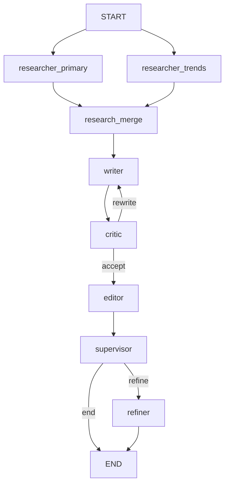

# ResearchFlow 🧠🌊

> **Deep Research. Automated.**

[](https://www.python.org/)
[](https://fastapi.tiangolo.com/)
[](https://react.dev/)
[](https://langchain-ai.github.io/langgraph/)
[](https://sambanova.com/)
[](./LICENSE)

**ResearchFlow** is a LangGraph-based multi-step research pipeline with conditional routing, designed to conduct in-depth internet research and generate high-quality, comprehensive reports. By orchestrating specialized steps—a **Researcher**, **Writer**, **Critic**, **Editor**, and optional **Refiner**—ResearchFlow transforms a single user prompt into a polished, citation-backed document, turning hours of manual work into a seamless automated workflow.

---

## 🚀 Why ResearchFlow?

In the era of information overload, finding accurately sourced summaries is difficult. Simple LLM chats often hallucinate facts or provide shallow answers. ResearchFlow solves this by forcing a **structure** of behavior that mimics a real-world editorial team.

### The Impact
*   **Accuracy & Grounding:** By using real-time web search (Tavily/DuckDuckGo), ResearchFlow reduces hallucinations. Every claim is cross-referenced with live data.
*   **Depth over Breadth:** Unlike a standard chatbot that gives you one shot, ResearchFlow iterates. The **Editor** agent critiques the **Writer's** draft, forcing rewrites until quality standards are met.
*   **Enterprise Speed:** Powered by **SambaNova's** inference engine, complex multi-agent reasoning steps that usually take minutes happen in seconds.
*   **For Everyone:** From academic researchers to market analysts, this tool democratizes access to deep, structured report generation without needing prompt engineering expertise.

---

## ⚡ Key Features

*   **🕵️‍♂️ Autonomous Researcher Agent:** Intelligently queries search engines, scrapes top results, and extracts key facts relevant to the user's topic.
*   **✍️ Pro Writer Agent:** Synthesizes scattered data into structured, readable reports with proper sections and flows.
*   **📝 Critical Editor Agent:** Reviews drafts for clarity, accuracy, and flow, rejecting sub-par work and requesting revisions automatically.
*   **🕸️ Graph-Based Workflow:** Built on **LangGraph**, enabling complex state management, loops (Editor sending back to Writer), and conditional logic.
*   **⚡ High-Performance Backbone:** Uses **FastAPI** for asynchronous request handling and **MongoDB** for session persistence.
*   **🎨 Modern React UI:** A clean, responsive interface to track agent progress live and view beautifully formatted Markdown reports.

---

## 🏗️ Architecture

ResearchFlow treats the research process as a state machine via LangGraph:

1.  **User Input:** Topic is received via the Frontend.
2.  **Parallel Research Phase:** Two research branches run in parallel (primary + recent trends), then merge sources.
3.  **Drafting Phase:** The **Writer** turns research data into a full draft.
4.  **Critique Phase:** The **Critic** scores the draft and decides whether a rewrite is required.
5.  **Editing Phase:** The **Editor** polishes the accepted draft.
6.  **Supervisor Routing:** The **Supervisor** routes to **Refiner** (if requested) or ends the flow.
7.  **Delivery:** The final report is streamed to the user.

---

## 🧭 Multi-Agent Orchestration Roadmap

The workflow is built as a state graph with explicit routing decisions and memory-aware agents. Recent orchestration upgrades include:

*   **LLM Supervisor Routing:** An LLM-driven router chooses between **writer**, **refiner**, or **end** based on state and user intent.
*   **Parallel Research Fan-Out:** Two research branches run in parallel and merge into a single, deduplicated source set.
*   **Critic Gate:** A critic node scores draft quality and decides whether rewrites are needed.
*   **Agent Message History:** Each agent appends structured notes so downstream agents can reference prior outputs.
*   **Opt-In Memory:** Short-term memory lives in workflow state while long-term memory persists to MongoDB.



---

## 🛠️ Tech Stack

### Backend
*   **Core:** Python 3.11+, FastAPI
*   **AI Orchestration:** LangChain, LangGraph
*   **LLM Provider:** SambaNova (primary), OpenAI (compatible)
*   **Search & Scrape:** Tavily API, DuckDuckGo Search, BeautifulSoup4
*   **Database:** MongoDB (Motor async driver)

### Frontend
*   **Framework:** React (Vite)
*   **Styling:** Tailwind CSS
*   **Animation:** Framer Motion
*   **State:** React Hooks

---

## 🏁 Getting Started

### Prerequisites
*   [Docker](https://www.docker.com/) & Docker Compose (Recommended)
*   OR Python 3.10+ & Node.js 18+
*   API Keys:
    *   **SambaNova API Key:** For the LLM ([Get it here](https://cloud.sambanova.ai/))
    *   **Tavily API Key:** For search ([Get it here](https://tavily.com/))

### Installation (Docker - Recommended)

1.  **Clone the repository:**
    ```bash
    git clone https://github.com/yourusername/Research-Flow.git
    cd Research-Flow
    ```

2.  **Configure Environment Variables:**
    Create a `.env` file in `backend/` and `frontend/`:
    
    `backend/.env`:
    ```env
    SAMBANOVA_API_KEY=gsk_...
    TAVILY_API_KEY=tvly-...
    MONGODB_URL=mongodb://mongodb:27017
    ```

3.  **Run with Docker Compose:**
    ```bash
    docker-compose up --build
    ```

4.  **Access the App:**
    *   Frontend: `http://localhost:5173`
    *   Backend Docs: `http://localhost:8000/docs`

### Manual Installation

<details>
<summary>Click to view manual setup instructions</summary>

#### Backend
```bash
cd backend
python -m venv venv
source venv/bin/activate  # or venv\Scripts\activate on Windows
pip install -r requirements.txt
uvicorn app.main:app --reload
```

#### Frontend
```bash
cd frontend
npm install
npm run dev
```

</details>

---

## 💡 Usage

1.  Open the dashboard at `http://localhost:5173`.
2.  Click **"Start New Research"**.
3.  Enter a research topic (e.g., *"The impact of Quantum Computing on Cybersecurity in 2025"*).
4.  Watch the agents work in real-time:
    *   See the **Researcher** finding sources.
    *   Watch the **Writer** drafting.
    *   Wait for the **Editor's** seal of approval.
5.  Read, download, or copy your final report.

---

## 🔮 Roadmap

*   [ ] **Export Options:** PDF and Docx export support.
*   [ ] **Human-in-the-Loop:** Allow users to pause and guide the researcher mid-flow.
*   [ ] **Multi-Session Context:** Allow agents to remember previous research sessions.
*   [ ] **Local LLM Support:** Integration with Ollama for privacy-focused offline research.

---

## 🤝 Contributing

Contributions are welcome! Please feel free to submit a Pull Request.

1.  Fork the Project
2.  Create your Feature Branch (`git checkout -b feature/AmazingFeature`)
3.  Commit your Changes (`git commit -m 'Add some AmazingFeature'`)
4.  Push to the Branch (`git push origin feature/AmazingFeature`)
5.  Open a Pull Request

---

## 📄 License

Distributed under the MIT License. See `LICENSE` for more information.

---

<p align="center">
  Built with ❤️ by Vishal M
</p>
